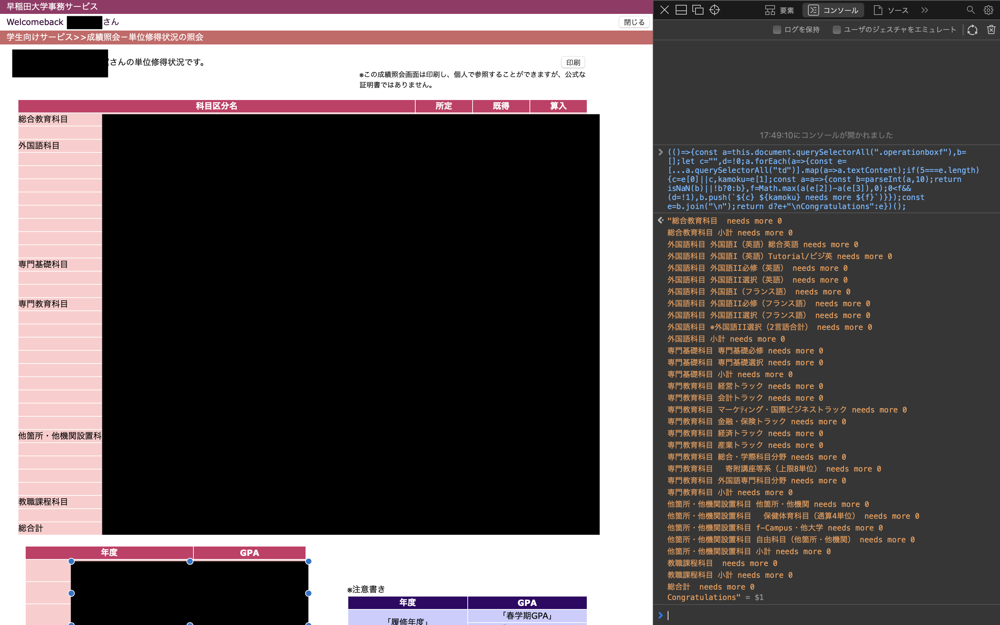

# 早稲田の卒業までに必要な単位数を数えるスクリプト
## 使い方
単位取得状況の紹介の画面に移動する。

chromeやsafariの検証機能を開く。

console画面に以下のコードを入力する。

```js
(()=>{const a=this.document.querySelectorAll(".operationboxf"),b=[];let c="",d=!0;a.forEach(a=>{const e=[...a.querySelectorAll("td")].map(a=>a.textContent);if(5===e.length){c=e[0]||c,kamoku=e[1];const a=a=>{const b=parseInt(a,10);return isNaN(b)||!b?0:b},f=Math.max(a(e[2])-a(e[3]),0);0<f&&(d=!1),b.push(`${c} ${kamoku} needs more ${f}`)}});const e=b.join("\n");return d?e+"\nCongratulations":e})();
```

結果が出力される。



## 注意
このスクリプトや単位取得に関する一切の責任は負いません。
